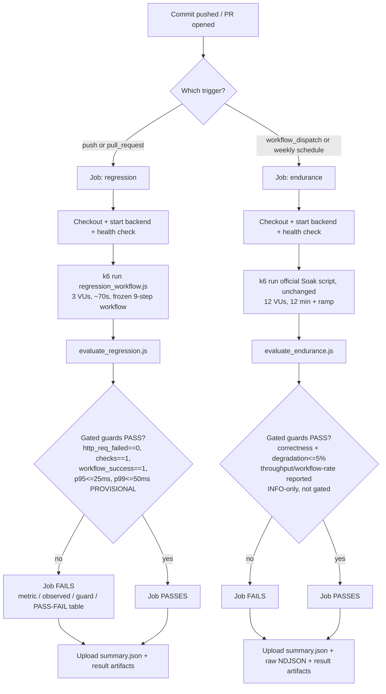

# HW05 Task 3 — Continuous Performance Testing

Status: **COMPLETE / HUMAN-REVIEWED**

Detailed working documentation, full trade-off discussion, and the two-round human-review history remain in [`work/task3_continuous_performance_pipeline.md`](../work/task3_continuous_performance_pipeline.md). This file is the cleaned, submission-facing version.

## 1. Requirement

Authoritative source: `docs/hw05-req/2026.HW05.Performance Testing_En_2.0_HTThanh.md`, §6 Task 3 (graded item 5, 10 points, Bloom-AI G9.6 Disrupt):

> In your conclusion, propose a continuous performance-testing model that watches the SUT's commits, decides whether to run performance tests, and flags p95 regressions. Include a flow chart and a discussion of the trade-offs (cost, false alarms).

This document delivers that proposal, and additionally implements and locally validates a working version of it (GitHub Actions pipeline, k6 scripts, threshold evaluators) so the proposal is demonstrated, not only described. The implementation is a regression-detection tool scoped to this repository's own workflow and evidence — not a business SLO or a production-capacity guarantee.

## 2. Continuous Performance Testing Model

One workflow file, two independent jobs, both exercising the same frozen "New Customer Onboarding and First Order" 9-step E2E workflow (Register -> Login -> Read Profile -> Update Profile -> Read Categories -> Read Products -> Read Product Detail -> Add Product to Cart -> Checkout):

| Job | Watches | Runs | Evaluates |
|---|---|---|---|
| **`regression`** (fast) | Every commit / PR | `push` and `pull_request` to `main`/`hw05-performance` | Correctness guards (strict) + HTTP p95/p99 latency guards (gated, provisional — see §5) against a short 3-VU/~70-90s profile. |
| **`endurance`** (full) | On demand / weekly | `workflow_dispatch` or a weekly `schedule` (`0 18 * * 0`) | Correctness + early-to-late throughput degradation (strict) against the full, unmodified 12-VU/12-minute official Soak protocol; reports the absolute Task 1 throughput/workflow-rate floor for visibility (see §6). |

The fast job decides, on every commit, whether the change stays within the correctness and provisional-latency envelope; the slow job periodically re-validates sustained-load behavior without paying that cost on every commit.

## 3. Flowchart



## 4. CI Implementation

| Artifact | Path |
|---|---|
| GitHub Actions workflow | [`.github/workflows/performance-regression.yml`](../.github/workflows/performance-regression.yml) |
| Regression k6 entry script | [`out/ci/regression_workflow.js`](ci/regression_workflow.js) |
| Shared 9-step workflow logic | [`out/ci/lib/workflow_steps.js`](ci/lib/workflow_steps.js) |
| Shared CSV-contract validation | [`out/ci/lib/csv_contract.js`](ci/lib/csv_contract.js) |
| Regression guard evaluator | [`out/ci/evaluate_regression.js`](ci/evaluate_regression.js) |
| Endurance guard evaluator | [`out/ci/evaluate_endurance.js`](ci/evaluate_endurance.js) |
| Endurance target (unmodified) | [`out/23127179_Soak_20260817.js`](23127179_Soak_20260817.js) |

`workflow_steps.js` and `csv_contract.js` are extracted from the reviewed official `out/23127179_Load_20260817.js` — same 9 requests, same semantic checks, same CSV contract — so the CI workflow is not a re-implementation or a simplified copy of the reviewed workflow.

## 5. Regular Regression Profile

- Runner: GitHub-hosted `runs-on: ubuntu-latest`.
- Workload: `ramping-vus`, 1→3 VUs over 15s, hold 3 VUs for 45s, 3→0 VUs over 10s (total ≈70-90s).
- Workflow: the frozen 9-step E2E workflow, unchanged request/check logic, same CSV data (`out/user_workflow_data.csv`).

**Strict gates** (hardware-independent correctness):

- `http_req_failed == 0`
- `checks == 1`
- `workflow_success == 1`

**Provisional GitHub-hosted regression guards** (still gated, but explicitly not a validated cross-hardware baseline):

- HTTP `p(95) <= 25 ms`
- HTTP `p(99) <= 50 ms`

**Hardware-scope statement (human-reviewed final wording):** these p95/p99 values originated from local reviewed evidence — the Load/Stress/Spike/Soak runs on the student's own Dell hardware, human-approved in `work/task2_performance_analysis.md` §7 — and require re-baselining on the GitHub-hosted CI environment before being treated as a long-term operational baseline. `ubuntu-latest` is **not** hardware-comparable to the Task 1 Dell machine; a FAIL on these two guards is a signal to investigate, not a confirmed regression against the Task 1/2 baseline.

## 6. Endurance Strategy

- Runs the full, **unmodified** official Soak protocol: `out/23127179_Soak_20260817.js`, same CSV, same 12-VU/12-minute + warmup/exit-ramp schedule already reviewed and executed for Task 1/2 (official run ID `20260818t000551547`).
- Trigger: `workflow_dispatch` or the weekly `schedule` only — never on every commit.

**On `ubuntu-latest`, strict gates:**

- Correctness (`http_req_failed == 0`, `checks == 1`, `workflow_success == 1`)
- Early-to-late throughput degradation `<= 5%` (a same-run relative comparison, hardware-independent)

**Informational only (does not fail GitHub-hosted CI):**

- Local Task 1 throughput floor: `7.983 req/s`
- Local Task 1 clean-workflow floor: `0.829 workflows/s`

These two absolute values are the **final empirical Task 1/2 findings for the reviewed local Dell hardware** (`work/context_handoff_after_task2_before_task3.md`) and must not fail GitHub-hosted CI until a CI-specific baseline is established on `ubuntu-latest` itself. `evaluate_endurance.js` still computes and reports them every run for visibility.

## 7. Cost / False-Alarm Trade-offs

- The short `regression` job gives fast per-commit feedback (~2-3 CPU-minutes) at low CI cost; running the full Soak protocol on every commit instead would cost ~15-20 CPU-minutes per commit for a solo/course-scale repository.
- p95/p99 on a 3-VU/~70s profile can vary run-to-run on a noisy/shared hosted runner (observed locally: p99 ranged ~20-44ms across two back-to-back runs of the same unmodified code) — a healthy commit could occasionally be flagged.
- The `endurance` job is far more expensive, so it runs weekly/manually rather than per-commit; this means a genuine throughput regression can go undetected for up to a week — a deliberate cost-vs-detection-latency trade-off.
- The short profile alone cannot catch problems that only manifest under sustained load (e.g., a slow degradation that only appears after minutes) — that is why the endurance job exists as a separate, slower safety net.
- A self-hosted runner on the student's own Dell hardware was considered (it would keep the guards hardware-comparable without relabeling), but was rejected for this course submission because it would require that machine to be online whenever CI runs, including whenever a TA re-triggers the workflow for grading — not reproducible for someone without access to that machine.

## 8. PASS / FAIL Logic

Both jobs share the same evaluator pattern: `evaluate_regression.js` / `evaluate_endurance.js` reads the run's output, prints a Markdown table (`Metric | Observed | Guard | Result`) to the job log and an uploaded artifact, and exits non-zero if any **gated** guard failed — which fails the CI step and the job. Informational-only metrics (the two absolute endurance numbers, and the two provisional latency numbers' extended labeling) are always reported but never change the exit code by themselves beyond their own gated status. No raw k6 log inspection is required to see why CI failed.

Example (real, reproduced locally against a synthetic FAIL fixture):

```
| Metric | Observed | Guard | Result |
|---|---:|---|---|
| http_req_failed | 0.05 | == 0 | FAIL |
| checks | 1 | == 1 | PASS |
| workflow_success | 1 | == 1 | PASS |
| http_req_duration p(95) [provisional, not re-baselined on ubuntu-latest] | 31.2 ms | <= 25 ms | FAIL |
| http_req_duration p(99) [provisional, not re-baselined on ubuntu-latest] | 19.731 ms | <= 50 ms | PASS |

Overall: FAIL
```

## 9. Generated CI Artifacts

| Job | Artifacts | Retention |
|---|---|---|
| `regression` | `summary.json` (k6 native summary), `regression-result.json`, `regression-result.md`, `k6-stdout.log` | 14 days |
| `endurance` | `summary.json`, `endurance-result.json`, `endurance-result.md`, `raw-results.ndjson` | 5 days |

The regression job never uploads raw NDJSON (unnecessary for a per-commit job). The endurance job uploads the raw NDJSON with short retention because it is not per-commit and the reviewed Task 1/2 evidence directory already holds the authoritative raw NDJSON for the official run.

## 10. Validation

Actually performed locally in this session, evidence-first, no fabricated results:

- One real PASS execution of the regression profile against the live local backend, reproduced from both `out/` and repo-root working directories (matching the exact CI invocation path).
- `evaluate_regression.js` validated against that real `summary.json` (PASS) and a synthetic fixture with a forced `p(95)=31.2ms` / `http_req_failed=0.05` (FAIL, exit code 1).
- `evaluate_endurance.js` validated against the **real, existing official Soak raw NDJSON** (`out/23127179_Soak_20260817_evidence/20260818t000551547/raw-results.ndjson`) — reproduced the exact HUMAN-REVIEWED 7.983 req/s / 0.829 workflows/s minima, reported as `INFO` (not gating) — and against a synthetic degraded fixture (late-window throughput dropped 25%, correctly FAILs via the still-gated degradation guard, exit code 1).
- The corrected endurance-job path (`23127179_Soak_20260817.js` relative to `working-directory: out`) was reproduced locally: it loads the script and reaches the script's own `K6_RUN_ID` validation error, contrasted directly against the original buggy path, which fails with "couldn't be found on local disk."
- Backend start/health-check pattern (`node server.js` + `/api/products` polling) validated locally with the same logic used in the workflow YAML.

**Explicitly not performed:** actual execution inside GitHub Actions. No `gh` workflow run was triggered; the YAML has only been checked for valid syntax and its steps reproduced locally command-by-command, not run inside an Actions runner. This is a documented limitation, not a hidden claim.

## 11. Final Human Review

**Task 3 = COMPLETE / HUMAN-REVIEWED.**

Two rounds of human review were completed and closed:

- **Round 1** found and required fixing a real endurance-job path bug (`working-directory: out` + `out/23127179_Soak_20260817.js` would have resolved to a nonexistent nested path), a trigger-strategy documentation error, and an overstated PASS-result interpretation. All three were fixed and re-verified.
- **Round 2** approved all five core logic files, then found that both CI jobs run on GitHub-hosted `ubuntu-latest` while the numeric guards were measured on local Dell hardware. Resolved by splitting guards into strict/provisional/informational tiers as documented in §5-6 above, in preference to a self-hosted runner (see §7).

No remaining Task 3 human-review items.
