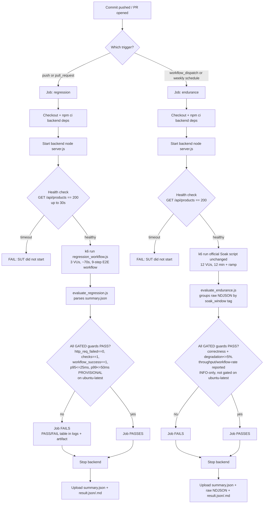

# HW05 Task 3 — Continuous Performance Testing

Status: **AWAITING HUMAN REVIEW**

## Requirement

Authoritative source: `docs/hw05-req/2026.HW05.Performance Testing_En_2.0_HTThanh.md`, §6 Task 3
(graded item 5, 10 points, Bloom-AI G9.6 Disrupt):

> In your conclusion, propose a continuous performance-testing model that watches the SUT's
> commits, decides whether to run performance tests, and flags p95 regressions. Include a flow
> chart and a discussion of the trade-offs (cost, false alarms).

The assignment asks for a **proposal** with a flowchart and a trade-off discussion. This
document delivers that proposal and additionally implements and locally validates a working
version of it (GitHub Actions pipeline, k6 scripts, threshold evaluators), so the proposal is
demonstrated rather than only described. The implementation is scoped to this repository's own
hardware/dataset/harness — it is a regression-detection tool, not a business SLO or a
capacity/production guarantee.

## Hardware Scope

**Found in human review (round 2), fixed in this revision.** Task 2 explicitly scoped every
numeric guard to "comparable hardware, dataset, harness/profile"
(`work/task2_performance_analysis.md` §7). Both CI jobs run on GitHub-hosted `runs-on:
ubuntu-latest` — not the student's local Dell hardware the 25ms/50ms/7.983 req/s/0.829
workflows/s numbers were measured on. Silently reusing those numbers as CI gates would compare
two different machines and call a difference a "regression" against a baseline that was never
established on this runner. The fix applied here, consistently across the YAML, both evaluator
scripts, and this document:

| Guard | Independent of hardware? | Treatment on `ubuntu-latest` |
|---|---|---|
| `http_req_failed==0`, `checks==1`, `workflow_success==1` | Yes — correctness, not a timing measurement | Fully gated, unchanged. |
| Early-to-late throughput degradation `<=5%` | Yes — a same-run relative comparison (late window vs. early window on the same run/hardware) | Fully gated, unchanged. |
| HTTP p95 `<=25ms` / p99 `<=50ms` | No — absolute timing measured on Dell hardware | Kept as a **PROVISIONAL CI-environment guard**: same numeric values, still gates CI, but explicitly labeled as not re-baselined on `ubuntu-latest`. A FAIL is a signal to investigate, not a confirmed regression against the Dell baseline. |
| Sustained throughput `>=7.983 req/s` / clean workflow rate `>=0.829 workflows/s` | No — absolute rates measured on Dell hardware | **Informational only**: computed and reported every run, but does **not** gate CI on this runner. |

This is a deliberate, documented trade-off (see AskUserQuestion decision in the AI Audit Report,
Artifact #28): the alternative — a self-hosted runner on the student's own Dell machine so the
hardware genuinely matches — was rejected because it would require that machine to be online
whenever CI runs, including whenever a TA re-triggers the workflow for grading, which is not
reproducible for someone without access to that machine.

## Pipeline Design



Two jobs in one workflow file, split by cost rather than by concept — both evaluate the same
frozen "New Customer Onboarding and First Order" E2E workflow (Register -> Login -> Read
Profile -> Update Profile -> Read Categories -> Read Products -> Read Product Detail -> Add
Product to Cart -> Checkout), just at different VU counts/durations:

- **`regression`** — cheap, runs on every push/PR. Correctness (gated) + latency (gated,
  provisional — see Hardware Scope) guards only.
- **`endurance`** — expensive, runs only on manual dispatch or a weekly schedule. Correctness and
  degradation are gated; absolute throughput/clean-workflow-rate are reported informationally
  (see Hardware Scope).

## Trigger Strategy

| Trigger | Job that runs | Rationale |
|---|---|---|
| `push` to `main` / `hw05-performance` | `regression` | Catch regressions as soon as they land. |
| `pull_request` to `main` / `hw05-performance` | `regression` | Catch regressions before merge; ~70s k6 run keeps PR feedback fast. |
| `workflow_dispatch` | both `regression` and `endurance` run | Let a human force either profile on demand, e.g. before a release; a manual dispatch is cheap enough (one-off) that running both is acceptable. |
| `schedule` (weekly, `0 18 * * 0`) | `endurance` only | Amortizes the expensive 12-VU/12-minute protocol instead of paying for it on every commit. |

**Cost/false-alarm trade-offs (per the assignment's explicit ask):**

- **Cost.** The `regression` job costs ~2-3 CPU-minutes per push/PR (npm install + ~70s k6 run).
  Running the full Soak protocol on every commit instead would cost ~15-20 CPU-minutes per
  commit — for a solo/course-scale repository that is disproportionate to the marginal
  regression-detection value, which is why endurance is weekly/manual instead.
- **False alarms from a short, low-VU profile.** 3 VUs for ~70s produces roughly 35-45
  iterations, i.e. a few hundred latency samples. p95/p99 on that few samples has real run-to-run
  variance (observed locally: p99 ranged ~20-44ms across two back-to-back runs on the same
  unmodified code, both still under the 50ms guard but not by a fixed margin). A shared/noisy
  CI runner could push a healthy commit over the guard by chance. Mitigation options if this
  proves noisy in practice: re-run once before failing (quarantine-and-retry), or widen the
  guard band for the short profile specifically instead of reusing the Task 2 numbers verbatim.
  This trade-off is documented rather than silently "fixed" because retrying was not requested
  and would mask real regressions if applied blindly.
- **False alarms from the endurance job.** Being scheduled/manual rather than per-commit means a
  throughput regression is detected up to a week late, not at the commit that caused it — the
  classic cost-vs-detection-latency trade-off inherent to expensive endurance profiles.
- **Missed regressions.** The short profile cannot detect throughput-under-sustained-load
  regressions (e.g., a slow memory/connection leak that only manifests after minutes) — that is
  exactly why the endurance job exists as a separate, slower safety net rather than being folded
  into the fast path.

## Performance Regression Profile

CI regression profile (`out/ci/regression_workflow.js`), reusing the shared workflow logic in
`out/ci/lib/workflow_steps.js` and `out/ci/lib/csv_contract.js` (extracted from the reviewed
official `out/23127179_Load_20260817.js`, unchanged in behavior — same 9 requests, same
semantic checks, same CSV contract):

- Executor: `ramping-vus`, 1→3 VUs over 15s, hold 3 VUs for 45s, 3→0 VUs over 10s
  (`gracefulRampDown`/`gracefulStop` 15s each; total wall time ≈70-90s).
- Think-time between steps shortened to 1-2s (vs. the official Load script's calibrated 1-5s)
  so a 3-VU/70s profile still yields enough iterations for a meaningful p95/p99 sample; this is
  a deliberate CI-only deviation, not a claim that it reproduces Load's calibrated pacing.
- CSV data: `out/user_workflow_data.csv` (same 3-row dataset used by the official scenarios).

## Regression Guards

Enforced in the `regression` job by `out/ci/evaluate_regression.js`, reading the k6
`--summary-export` JSON (k6's own native `thresholds` block enforces the same values as a
redundant safety net — see `out/ci/regression_workflow.js`):

| Metric | Guard | Gated? | Source |
|---|---|---|---|
| `http_req_failed` | `== 0` | Yes | HUMAN-APPROVED, `work/task2_performance_analysis.md` §7 |
| `checks` | `== 1` | Yes | same |
| `workflow_success` | `== 1` | Yes | same |
| HTTP `p(95)` | `<= 25 ms` | Yes, provisional | same numeric value; **not re-baselined on `ubuntu-latest`** — see Hardware Scope |
| HTTP `p(99)` | `<= 50 ms` | Yes, provisional | same numeric value; **not re-baselined on `ubuntu-latest`** — see Hardware Scope |

**Scope caveat (revised after human review round 2):** the p95/p99 numbers were established from
Load/Stress/Spike/Soak runs at 4-24 VUs on the student's local Dell hardware, where tail latency
did not scale materially with VU count (13-33ms across that range). Applying them to a 3-VU
short CI profile carries two separate, stacked assumptions: (1) that the non-scaling-with-VUs
relationship holds down to 3 VUs, and (2) that GitHub-hosted `ubuntu-latest` performs comparably
to the Dell hardware in the first place. The first is a reasonable same-hardware extrapolation;
the second is **not yet validated at all** — no CI-native calibration run has been performed on
`ubuntu-latest`. That is why these two guards are labeled PROVISIONAL rather than treated as the
Task 2 human-approved baseline itself: they still gate CI (a real functional guard exists), but
a FAIL should be read as "investigate," not "confirmed regression against the reviewed
baseline." These are **not** business SLOs, maximum capacity, or production guarantees.

## Endurance Guard Strategy

The three throughput/degradation guards from `work/context_handoff_after_task2_before_task3.md`
are **not** applied in the short `regression` job — they were derived from and are only
meaningful at the full 12-VU/12-minute protocol. Within the dedicated `endurance` job itself,
they further split by hardware-dependence (see Hardware Scope):

| Metric | Guard | Gated on `ubuntu-latest`? |
|---|---|---|
| Early-to-late throughput degradation | `<= 5%` | **Yes** — same-run relative comparison, hardware-independent. |
| Sustained throughput (min steady-window req/s) | `>= 7.983 req/s` | **No — informational only.** Absolute number measured on Dell hardware; not comparable to `ubuntu-latest` without a CI-native re-baseline that has not been performed. |
| Clean workflow rate (min steady-window workflows/s) | `>= 0.829 workflows/s` | **No — informational only.** Same reason. |

The degradation and correctness guards are instead enforced in the dedicated `endurance` job,
which runs the **unmodified**
official Soak script `out/23127179_Soak_20260817.js` (same CSV, same 12-VU/12-minute/warmup/
exit-ramp schedule already reviewed and executed for Task 1/2 — official run ID
`20260818t000551547`). `out/ci/evaluate_endurance.js` groups the run's raw NDJSON output by the
`soak_window` tag the script already attaches to every request/check (`early_steady`,
`middle_steady`, `late_steady`), instead of recomputing wall-clock windows — the same grouping
approach used by the Task 1 evidence-grade verifier
(`out/23127179_Soak_20260817_evidence/20260818t000551547/verify_soak_results.js`), but without
that verifier's resource-CSV/screenshot/database-fact dependencies, which don't exist in a
headless CI run.

This job runs only on `workflow_dispatch` or a weekly schedule (§ Trigger Strategy) — never on
every commit — per the "do not create an unnecessarily expensive 12-minute Soak for every normal
commit" instruction.

## CI Failure Logic

Both jobs fail the same way: an evaluator script (`evaluate_regression.js` /
`evaluate_endurance.js`) reads the run's output, prints a Markdown PASS/FAIL table to the job
log, writes it to an artifact, and sets `process.exitCode = 1` if any guard failed — which fails
the CI step and therefore the job. No raw k6 log inspection is required to see why CI failed.

Example table (this exact format, reused for both jobs — real regenerated output from the
synthetic FAIL fixture described in Local Validation):

```
| Metric | Observed | Guard | Result |
|---|---:|---|---|
| http_req_failed | 0.05 | == 0 | FAIL |
| checks | 1 | == 1 | PASS |
| workflow_success | 1 | == 1 | PASS |
| http_req_duration p(95) [provisional, not re-baselined on ubuntu-latest] | 31.2 ms | <= 25 ms | FAIL |
| http_req_duration p(99) [provisional, not re-baselined on ubuntu-latest] | 19.731 ms | <= 50 ms | PASS |

Overall: **FAIL**
```

The endurance job's table additionally carries two `INFO`-result rows (sustained throughput,
clean workflow rate) that never affect `Overall` — see Example PASS / FAIL Interpretation below
for the full real output.

## Generated Artifacts

Per job, uploaded via `actions/upload-artifact`:

| Job | Artifacts | Retention |
|---|---|---|
| `regression` | `summary.json` (k6 native summary), `regression-result.json`, `regression-result.md`, `k6-stdout.log` | 14 days |
| `endurance` | `summary.json`, `endurance-result.json`, `endurance-result.md`, `raw-results.ndjson` | 5 days |

The regression job never uploads raw NDJSON (not generated — correctness/latency come from the
k6 summary export, which is sufficient and small). The endurance job does upload raw NDJSON
(~30MB for the full protocol) because it is not a per-commit job and the raw trace is the only
way to re-derive per-window rates for later human review; retention is kept short (5 days)
because it is not submission evidence — the reviewed Task 1/2 evidence directory already holds
the authoritative raw NDJSON for the official run.

## How to Run Locally

Regression profile (from repo root, backend already running on `:3000`):

```bash
K6_RUN_ID="localdev$(date +%s)" \
BASE_URL=http://localhost:3000 \
WORKFLOW_CSV_PATH=../user_workflow_data.csv \
k6 run --summary-export=summary.json out/ci/regression_workflow.js

node out/ci/evaluate_regression.js summary.json regression-result.json
```

Endurance profile (from `out/`, backend already running on `:3000` — this is the same
official Soak invocation used for Task 1, so treat a fresh run as new evidence, not a
replacement for run ID `20260818t000551547`):

```bash
cd out
K6_RUN_ID="localend$(date +%s)" BASE_URL=http://localhost:3000 \
  k6 run --summary-export=summary.json --out json=raw-results.ndjson 23127179_Soak_20260817.js
cd ..
node out/ci/evaluate_endurance.js out/raw-results.ndjson endurance-result.json
```

## How to Run in CI

- Automatic: push a commit or open a PR against `main`/`hw05-performance` → `regression` job
  runs automatically.
- Manual: GitHub → Actions → "Performance Regression" → "Run workflow" → choose which job runs
  based on the trigger you pick (`workflow_dispatch` runs both jobs' `if:` conditions true, so
  both execute).
- Scheduled: `endurance` runs automatically every Sunday at 18:00 UTC.

## Example PASS / FAIL Interpretation

**Regression job — PASS** (real local run reproduced with the current evaluator, see Local
Validation below):

```
| Metric | Observed | Guard | Result |
|---|---:|---|---|
| http_req_failed | 0 | == 0 | PASS |
| checks | 1 | == 1 | PASS |
| workflow_success | 1 | == 1 | PASS |
| http_req_duration p(95) [provisional, not re-baselined on ubuntu-latest] | 14.799 ms | <= 25 ms | PASS |
| http_req_duration p(99) [provisional, not re-baselined on ubuntu-latest] | 19.731 ms | <= 50 ms | PASS |

Overall: **PASS**
```

Read as: no configured guard was violated under this CI regression profile. This is not a claim
that the commit "behaves the same as" the HUMAN-REVIEWED Task 1/2 baseline: the 3-VU/~70s CI
profile differs from the reviewed 4-24 VU Dell baseline runs in VU count, duration, and
think-time, and (per Hardware Scope) the correctness result is fully authoritative but the
latency result is provisional because `ubuntu-latest` itself has never been compared to the Dell
baseline. PASS only means this specific short profile, on this commit, on this runner, did not
cross any of the guard thresholds.

**Regression job — FAIL** (synthetic fixture, not a real SUT run — see Local Validation):

```
| Metric | Observed | Guard | Result |
|---|---:|---|---|
| http_req_failed | 0.05 | == 0 | FAIL |
| checks | 1 | == 1 | PASS |
| workflow_success | 1 | == 1 | PASS |
| http_req_duration p(95) [provisional, not re-baselined on ubuntu-latest] | 31.2 ms | <= 25 ms | FAIL |
| http_req_duration p(99) [provisional, not re-baselined on ubuntu-latest] | 19.731 ms | <= 50 ms | PASS |

Overall: **FAIL**
```

Read as: either the commit introduced a real latency/error-rate regression, or the CI runner was
noisy for this run (see the false-alarm trade-off above) — re-run once to distinguish the two
before treating it as a confirmed regression. An `http_req_failed` FAIL is unambiguous
(hardware-independent); a latency-only FAIL is a weaker signal given the provisional guard.

**Endurance job — PASS** (real local run against the official Soak evidence, see Local
Validation below):

```
| Metric | Observed | Guard | Result |
|---|---:|---|---|
| http_req_failed | 0 | == 0 | PASS |
| checks | 1 | == 1 | PASS |
| workflow_success | 1 | == 1 | PASS |
| early-to-late throughput degradation | 0.468 | <= 5% | PASS |
| sustained throughput (min steady-window req/s) [INFORMATIONAL ONLY on ubuntu-latest] | 7.983 | >= 7.983 req/s (Dell-hardware absolute number, not gated here) | INFO (at/above Dell baseline) |
| clean workflow rate (min steady-window workflows/s) [INFORMATIONAL ONLY on ubuntu-latest] | 0.829 | >= 0.829 workflows/s (Dell-hardware absolute number, not gated here) | INFO (at/above Dell baseline) |

Overall: **PASS**
```

Read as: correctness held and throughput did not meaningfully degrade within this run — the two
`INFO` rows are reported for visibility (this particular data happens to come from the Dell run
itself, so it trivially matches; a real `ubuntu-latest` run could show `INFO (below Dell
baseline)` without failing CI, which is expected and not itself a regression signal).

## Human Review

Prepared for review, not yet finalized:

- **Pipeline files created:** `.github/workflows/performance-regression.yml`.
- **Supporting scripts created:** `out/ci/regression_workflow.js`,
  `out/ci/lib/workflow_steps.js`, `out/ci/lib/csv_contract.js`,
  `out/ci/evaluate_regression.js`, `out/ci/evaluate_endurance.js`.
- **Triggers:** `push`/`pull_request` to `main`/`hw05-performance` → `regression`;
  `workflow_dispatch` → both; weekly `schedule` (`0 18 * * 0`) → `endurance`.
- **Regular regression profile:** 3 VUs, ~70-90s, same 9-step E2E workflow.
- **Guards enforced (regular job):** `http_req_failed==0`, `checks==1`, `workflow_success==1`
  (fully authoritative), HTTP p95 `<=25ms`, HTTP p99 `<=50ms` (gated but PROVISIONAL — see
  Hardware Scope).
- **Endurance strategy:** unmodified official 12-VU/12-minute Soak script, run only on
  `workflow_dispatch`/weekly schedule; gated guards: correctness + degradation `<=5%`;
  informational-only (not gated) on `ubuntu-latest`: throughput `>=7.983 req/s`, workflow rate
  `>=0.829/s` — see Hardware Scope.
- **Local validation performed:**
  - One real PASS execution of the regression profile against the live local backend (twice,
    from both `out/` and repo-root working directories, matching the exact CI invocation path).
  - `evaluate_regression.js` validated against that real summary.json (PASS) and a synthetic
    fixture with a forced `p(95)=31.2ms` / `http_req_failed=0.05` (FAIL, exit code 1) — reproduced
    again after adding the provisional-guard labeling in human review round 2, same PASS/FAIL
    results.
  - `evaluate_endurance.js` validated against the **existing official Soak raw NDJSON**
    (`out/23127179_Soak_20260817_evidence/20260818t000551547/raw-results.ndjson`) — reproduced
    the exact HUMAN-REVIEWED numbers (7.983 req/s and 0.829 workflows/s minima, now reported as
    `INFO`, not gating) — and against a synthetic degraded fixture (late-window throughput
    dropped 25%, still FAILs via the gated degradation guard, exit code 1) — reproduced again
    after splitting gated/informational guards in human review round 2.
  - `out/23127179_Soak_20260817.js` (endurance job's target script) confirmed to load correctly
    from the fixed relative path (`23127179_Soak_20260817.js` under `working-directory: out`) by
    triggering the script's own `K6_RUN_ID` validation error rather than a file-not-found error —
    contrasted directly against the original buggy path, which does fail with "couldn't be found
    on local disk."
  - Backend start/health-check pattern (`node server.js` + `/api/products` polling) validated
    locally; identical logic is used in the workflow YAML.
- **Human review round 2 (hardware scope):** the reviewer approved all five core logic files
  (`regression_workflow.js`, `evaluate_regression.js`, `evaluate_endurance.js`,
  `workflow_steps.js`, `csv_contract.js`) on correctness of the 9-step workflow, CSV contract,
  and evaluator math, then flagged that both CI jobs run on GitHub-hosted `ubuntu-latest` while
  the Task 2 guards were scoped to "comparable hardware" — the student's local Dell machine.
  Resolved by relabeling p95/p99 as PROVISIONAL (same values, still gated, explicit caveat) and
  demoting the absolute throughput/workflow-rate numbers to informational-only on this runner;
  see Hardware Scope. The rejected alternative (self-hosted runner on the Dell machine) was
  explicitly declined because it would require that machine to be online whenever a TA
  re-triggers CI for grading.
- **Not validated:** the actual GitHub Actions execution (no `gh` run was triggered) — the
  workflow YAML has only been checked for valid syntax (`yaml.safe_load`) and its steps have
  been reproduced locally command-by-command, not run inside an Actions runner. The
  `grafana/setup-k6-action` marketplace action's exact behavior on `ubuntu-latest` was not
  exercised locally (only the k6 binary itself, same version, was exercised locally).
  `npm ci` in the backend directory was not re-run in this session (it was already installed
  from prior HW05 work) — its cold-install path in a clean CI runner is unverified.
- **Limitations:**
  - 3-VU/70s p95/p99 has visible run-to-run variance (see Trigger Strategy trade-offs); the
    guard could occasionally flag a healthy commit on a noisy runner.
  - The endurance job's weekly cadence means a throughput regression can go undetected for up to
    a week.
  - `database.sqlite` is reseeded by every backend start in CI, same as local — no state carries
    between regression and endurance job runs, or between separate CI runs.
